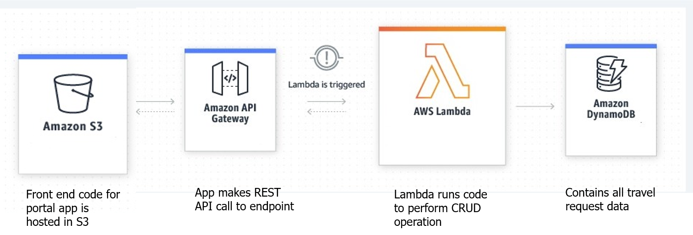

<h1>Employee Travel Details</h1>
<h2>About</h2>
For any travels being done in a corporate company, the employee need to take approval on the budget from the Senior VP of the department. The PMO role of respective projects need to gather the data for their projects from different employees in the project and share it in the form of an excel sheet.This project is a solution for it.
The user stories taken care are:
<ul>
  <li>As an employee, I need to submit the budget details of my travel so that the PMO team could take it forward for approval</li>
  <li>As a PMO, I want to download the details of the budget of the traveller in my project in the excel sheet format for a specific period to take it forward for approval</li>
  <li>As an employee, I want to update the budget details later on for the record already inserted</li>
  <li>As a PMO, I should be able to make out if the records were already downloaded and if there were any updates made to the record post download</li>
  </ul>
  
  <h2>Technologies used</h2>
  <ul>
  <li>React js</li>
  <li>Bootstrap</li>
  <li>AWS(S3,API Gateway,Lambda,DynamoDB)</li>
  </ul>

The front end code is hosted in AWS S3.When we make an api call,the lambda function gets triggered and it will perform the operations we needed.The lambda function which we use has dynamodb access.All the travel request datas are stored in dynamodb.

<h2>Instruction for users and Backend Lambda Code</h2>
The lambda code which was used in the backend is downloaded in zip format.This zip format can be uploaded to the required AWS account for performing the operation.But please make ensure that your lambda function has proper dynamodb access and make sure to set the API as well.Accordingly,please update the API in yout front end code.
 
 
Please see the below Repository for the backend code:  
https://github.com/Rufaid786/Employee-travel-details-backend_pythonAWSLambdacode  
As mentioned,the backend code which we did in the lambda is downloaded in zip format.It is then uploaded to the above mentioned repository.
In order to use the code in above repository
<ul>
  <li>Clone the repository</li>
  <li>Convert the code into a zip format</li>
  <li>Upload it into your AWS lambda</li>
</ul>
<h2></h2>
